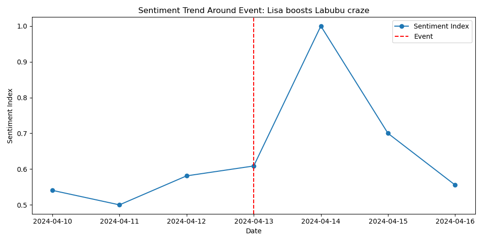
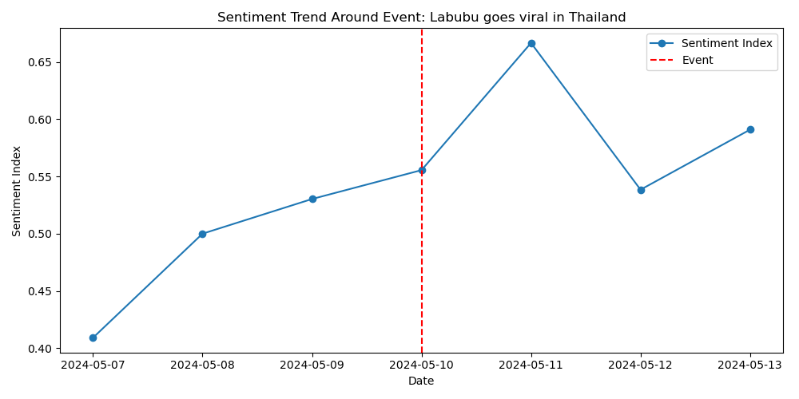
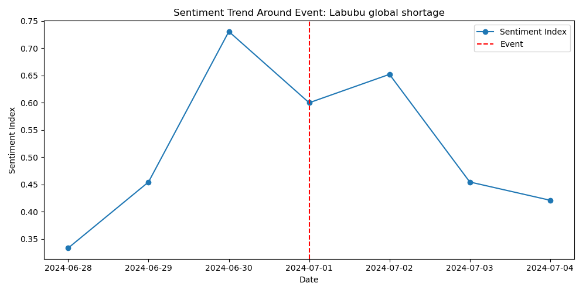
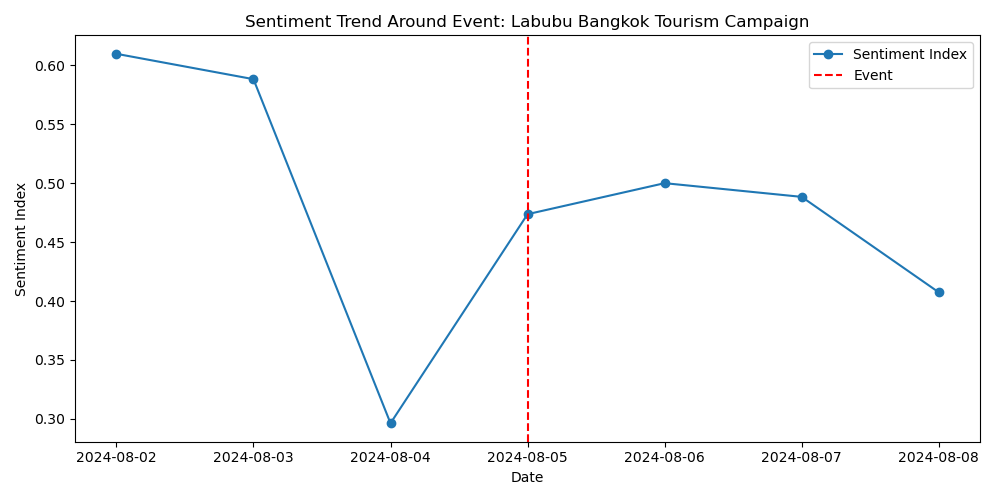

# Event Alignment Sentiment Report

## Event: Lisa boosts Labubu craze (2024-04-13)
- Type: Celebrity Impact
- Window Mean: 0.641
- Before Mean: 0.427
- After Mean: 0.533
- Max: 1.000, Min: 0.500
- Delta Before: 0.213, Delta After: -0.107
- Lag Days: 4, Rebound Days: 5
- t-test p: 0.104, Mann-Whitney U p: 0.253

## Event: Labubu goes viral in Thailand (2024-05-10)
- Type: Celebrity Impact/Policy
- Window Mean: 0.542
- Before Mean: 0.437
- After Mean: 0.626
- Max: 0.667, Min: 0.409
- Delta Before: 0.104, Delta After: 0.084
- Lag Days: 4, Rebound Days: 6
- t-test p: 0.281, Mann-Whitney U p: 0.833

## Event: Labubu global shortage (2024-07-01)
- Type: Supply Chain
- Window Mean: 0.521
- Before Mean: 0.574
- After Mean: 0.532
- Max: 0.731, Min: 0.333
- Delta Before: -0.053, Delta After: 0.011
- Lag Days: 2, Rebound Days: 6
- t-test p: 0.643, Mann-Whitney U p: 0.731

## Event: Labubu Bangkok Tourism Campaign (2024-08-05)
- Type: Policy
- Window Mean: 0.481
- Before Mean: 0.543
- After Mean: 0.431
- Max: 0.610, Min: 0.296
- Delta Before: -0.062, Delta After: -0.050
- Lag Days: 0, Rebound Days: 4
- t-test p: 0.423, Mann-Whitney U p: 0.667

