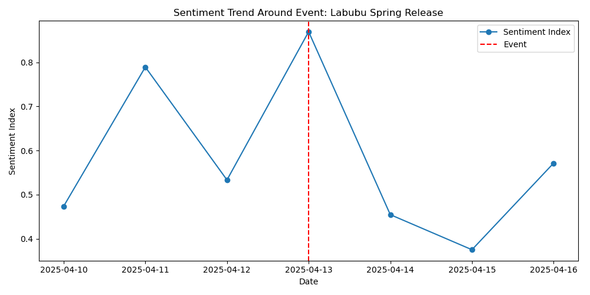
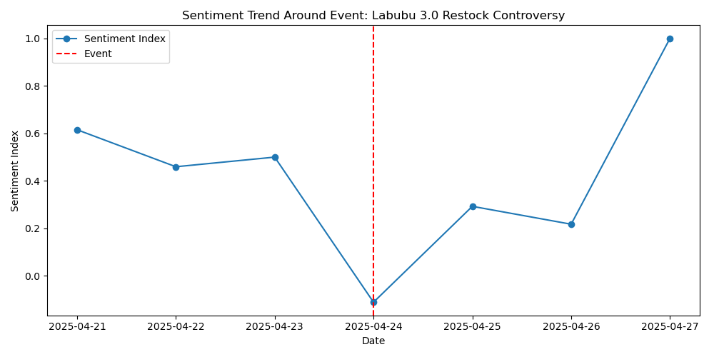
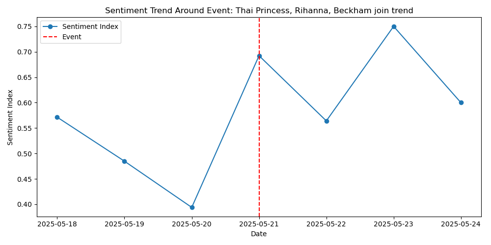
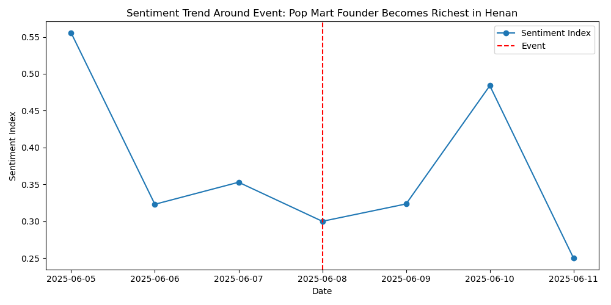
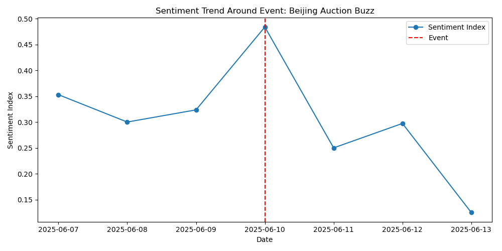
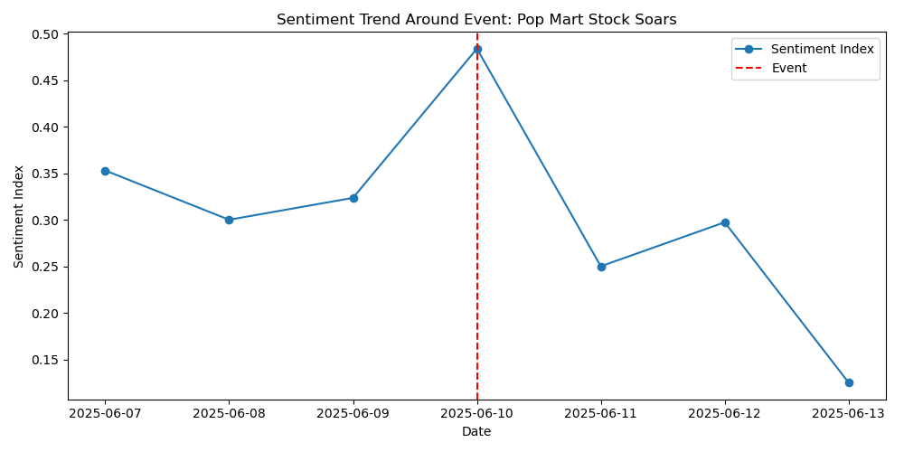
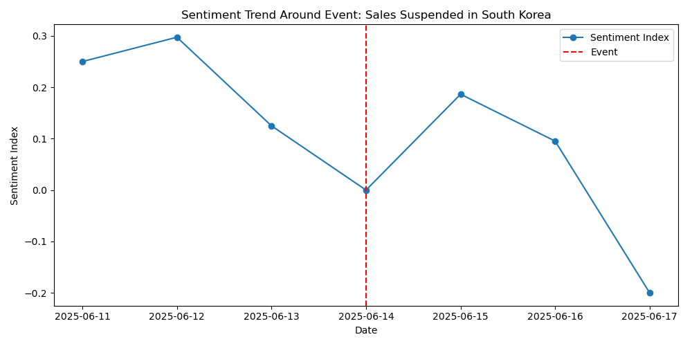
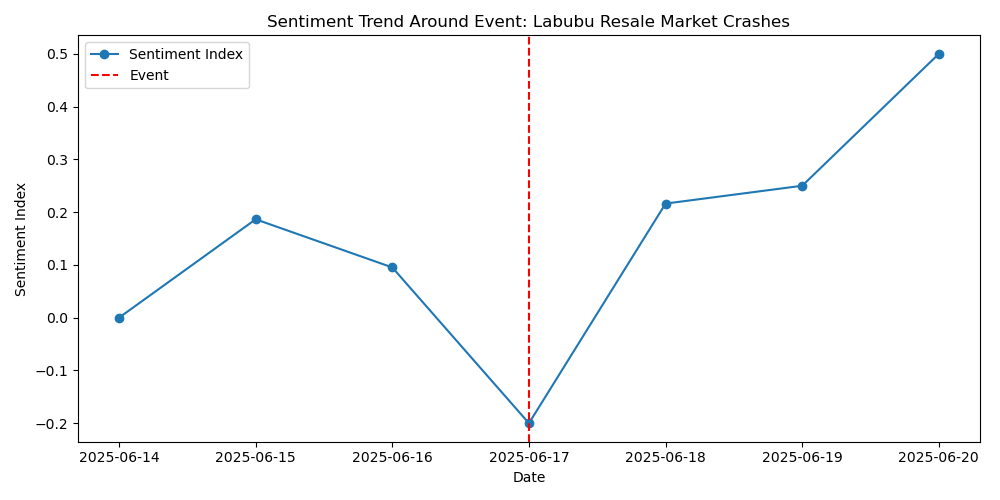

# Event Alignment Sentiment Report

## Event: Labubu Spring Release (2025-04-13)
- Type: New Product
- Window Mean: 0.581
- Before Mean: 0.690
- After Mean: 0.337
- Max: 0.870, Min: 0.375
- Delta Before: -0.109, Delta After: -0.244
- Lag Days: 3, Rebound Days: 1
- t-test p: 0.357, Mann-Whitney U p: 0.383

## Event: Labubu 3.0 Restock Controversy (2025-04-24)
- Type: Supply Chain
- Window Mean: 0.425
- Before Mean: 0.416
- After Mean: 0.404
- Max: 1.000, Min: -0.111
- Delta Before: 0.009, Delta After: -0.020
- Lag Days: 6, Rebound Days: 3
- t-test p: 0.967, Mann-Whitney U p: 1

## Event: Thai Princess, Rihanna, Beckham join trend (2025-05-21)
- Type: Celebrity Impact
- Window Mean: 0.580
- Before Mean: 0.400
- After Mean: 0.656
- Max: 0.750, Min: 0.394
- Delta Before: 0.180, Delta After: 0.076
- Lag Days: 5, Rebound Days: 4
- t-test p: 0.0516, Mann-Whitney U p: 0.0667

## Event: Pop Mart Founder Becomes Richest in Henan (2025-06-08)
- Type: Trending Topic
- Window Mean: 0.370
- Before Mean: 0.327
- After Mean: 0.141
- Max: 0.556, Min: 0.250
- Delta Before: 0.043, Delta After: -0.229
- Lag Days: 0, Rebound Days: 0
- t-test p: 0.573, Mann-Whitney U p: 1

## Event: Beijing Auction Buzz (2025-06-10)
- Type: Trending Topic
- Window Mean: 0.305
- Before Mean: 0.367
- After Mean: 0.094
- Max: 0.484, Min: 0.125
- Delta Before: -0.062, Delta After: -0.211
- Lag Days: 3, Rebound Days: 0
- t-test p: 0.497, Mann-Whitney U p: 0.833

## Event: Pop Mart Stock Soars (2025-06-10)
- Type: Trending Topic
- Window Mean: 0.305
- Before Mean: 0.367
- After Mean: 0.094
- Max: 0.484, Min: 0.125
- Delta Before: -0.062, Delta After: -0.211
- Lag Days: 3, Rebound Days: 0
- t-test p: 0.497, Mann-Whitney U p: 0.833

## Event: Sales Suspended in South Korea (2025-06-14)
- Type: Policy
- Window Mean: 0.108
- Before Mean: 0.369
- After Mean: 0.322
- Max: 0.297, Min: -0.200
- Delta Before: -0.261, Delta After: 0.214
- Lag Days: 1, Rebound Days: 0
- t-test p: 0.0391, Mann-Whitney U p: 0.0167

## Event: Labubu Resale Market Crashes (2025-06-17)
- Type: Supply Chain
- Window Mean: 0.150
- Before Mean: 0.224
- After Mean: 0.108
- Max: 0.500, Min: -0.200
- Delta Before: -0.074, Delta After: -0.042
- Lag Days: 6, Rebound Days: 3
- t-test p: 0.594, Mann-Whitney U p: 0.424

